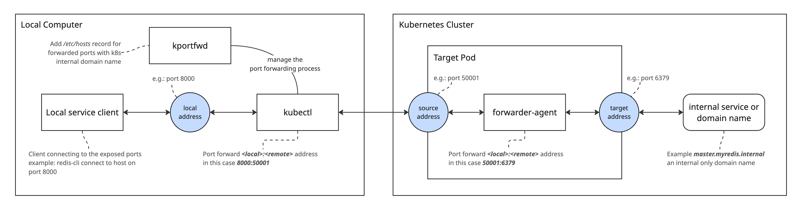

# kportfwd - K8S Port Forwarding Tools

Simple tools to port forward internal service and any domain name accessible inside kubernetes cluster and requires no setup on the cluster.

Example use case would be if you're using AWS RDS often times the database address is a domain name accessible only inside Kubernetes (EKS) cluster, this tool can help bridging the port forward.

If you're deploying VPN on cluster address making internal domain name seamlessly available on local machine, you're not gonna need this tool.

## Install

Download latest binary from [Release Page](https://github.com/abdularis/kportfwd/releases)

## Usage

Run help for more details

```bash
kportfwd --help
```

Run with specified configuration file

```
kportfwd port-forward --config /path/to/config.yaml
```

## Config YAML Example

```yaml
target:
  pod:
    labelSelector: "app=backend,!job-name" # find pod with give kubectl label selector
    container: service # container name on which the forwarder-agent will be deployed
    namespace: default # specifiy which namespace to find the target pod
forwards:
  - name: ""
    localAddr: "localhost:8000"
    sourceAddr: ":50001" # (optional) forwarder agent will decide random ports if not provided
    targetAddr: "{{REDIS_HOST}}:{{REDIS_PORT}}" # this uses go template syntax, you can extract value from environment variable inside target pod
  - name: "postgres"
    localAddr: "192.168.0.126:5432" # this will create loopback address alias for specified ip address
    targetAddr: "internal.postgresql:5432"
```

## Port Forwarding Process




## Build From Source

Require `make` and `docker` to build the binary.

Build for specific OS platform

```
make build-macos
# or
make build-linux
```

Install the binary on Go path directory

```
make install-macos
```

> make sure the Go path binary directory is in you PATH